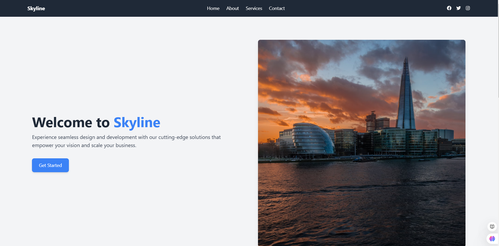
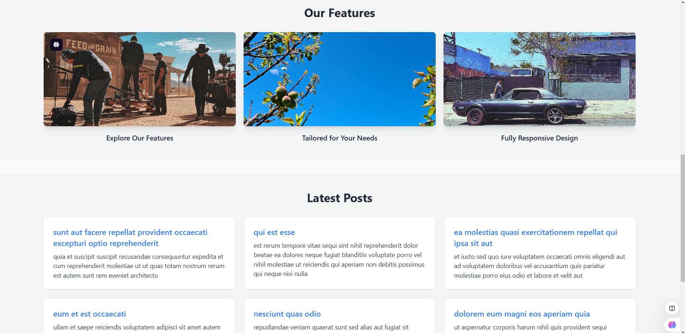
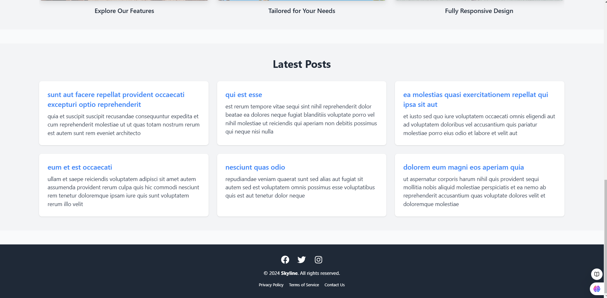

# Skyline

Skyline is a sample React project showcasing modern web development practices, including responsive design, dark/light themes, API integration, and deployment automation. It demonstrates the use of Tailwind CSS, React components, Axios for API calls, and CI/CD pipelines with Docker and AWS CloudFront.

## Project Repository

You can find the project repository [here](https://github.com/NoManNayeem/Skyline).

## Features

- **Responsive Design:** Fully responsive UI built with Tailwind CSS.
- **Dark/Light Mode:** Theme toggling for better user experience.
- **API Integration:** Demonstrates fetching data using Axios with environment variables.
- **Reusable Components:** Modular and reusable components for scalability.
- **Deployment:** Dockerized and CI/CD enabled, deployed on AWS CloudFront.

## Screenshots

### Hero Section


### Feature Section


### Footer Section


---

## Technologies Used

- **React:** Frontend framework.
- **Tailwind CSS:** Styling framework for rapid development.
- **Axios:** HTTP client for API integration.
- **Swiper.js:** For creating sliders.
- **React Icons:** For including scalable vector icons.
- **Docker:** For containerizing the application.
- **GitHub Actions:** For CI/CD automation.
- **AWS CloudFront:** For hosting and deploying the app.

## Setup and Installation

1. Clone the repository:
   ```bash
   git clone https://github.com/NoManNayeem/Skyline.git
   cd Skyline
   ```

2. Install dependencies:
   ```bash
   npm install
   ```

3. Create a `.env` file in the root directory and add the following:
   ```env
   REACT_APP_API_BASE_URL=https://jsonplaceholder.typicode.com
   ```

4. Start the development server:
   ```bash
   npm start
   ```

## File Structure

```
Skyline/
├── src/
│   ├── components/
│   │   ├── Navbar.js
│   │   ├── Hero.js
│   │   ├── Slider.js
│   │   ├── ApiSection.js
│   │   ├── Footer.js
│   ├── App.js
│   ├── index.css
│   ├── index.js
├── .env.example
├── Dockerfile
├── README.md
├── package.json
```

## Deployment

1. Build the Docker image:
   ```bash
   docker build -t skyline .
   ```

2. Run the Docker container:
   ```bash
   docker run -p 3000:3000 skyline
   ```

3. For production deployment, configure CI/CD using GitHub Actions and deploy to AWS CloudFront.

## Contribution

Feel free to fork the repository and submit pull requests. All contributions are welcome!

## License

This project is licensed under the MIT License. See the LICENSE file for details.

---

**Skyline** - Seamlessly scaling your ideas to the web.
